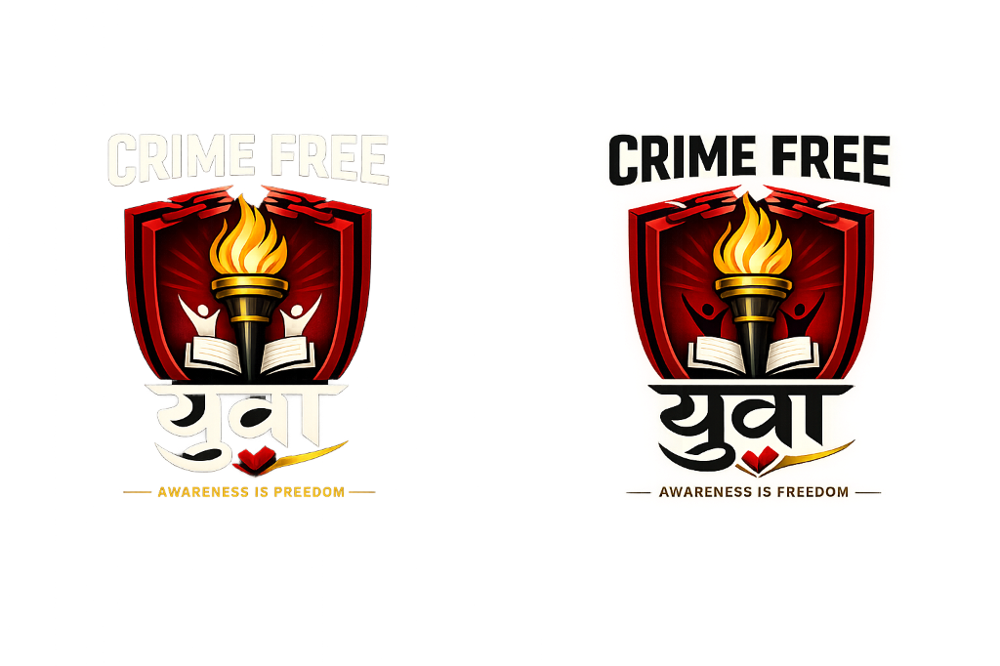
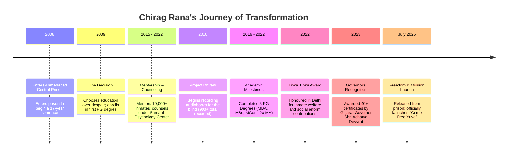

<p align="center">
  
</p>

<p align="center">
  
</p>

<p align="center">
  <a href="https://github.com/urrana1512/Crime-Free-Yuva"></a>
  <a href="#about-chirag-rana"></a>
  <a href="#tech-stack"></a>
</p>

---

## 🎯 The Mission & Vision

**"One mistake can destroy a life. But one session can save it."**

**Crime Free Yuva** (Crime Free Youth) is a national initiative founded by **Mr. Chirag Kishorbhai Rana**, a Crime Awareness Speaker, Motivator, and Social Reformer. Over 40% of crimes in India are committed by youth aged 18–30—often not out of criminal intent, but due to peer pressure, emotional impulsiveness, and a lack of basic legal awareness. 

This platform serves as a modern, interactive digital portal to educate students, host seminars, track bookings, and showcase real-life impact to prevent youth from taking the wrong path.

---

## 🎤 The Man Behind the Mission: Chirag Rana

Chirag Rana is not your typical motivational speaker. He completed a **17-year sentence** and emerged from **Ahmedabad Central Prison** in **July 2025** with a new lease on life and an unshakeable purpose: to prevent others from making the decisions that cost him 17 years. 

### 🏆 Transformational Highlights (Behind Bars)
*   **Academic Excellence:** Earned **5 Postgraduate Degrees** and a PG Diploma while incarcerated.
*   **Project Dhvani:** Recorded **900+ Audiobooks** in Gujarati, Hindi, Sanskrit, and English for the Ahmedabad Blind People’s Association.
*   **Inmate Mentorship:** Guided **10,000+ fellow inmates** through 10th, 12th, and bachelor's degree programs.
*   **Governor's Award (2023):** Honoured with **40+ certificates** by the Hon'ble Governor of Gujarat, Shri Acharya Devvrat, and DGP Dr. KLN Rao IPS.
*   **M.Sc. Presentation:** His M.Sc. degree certificate in Value Education & Spirituality was presented by Union Minister **Shri Nitin Gadkari**.

### 🎓 Academic Qualifications
*   **M.B.A.** (Human Resources)
*   **M.Sc.** (Value Education & Spirituality)
*   **M.A.** (Gujarati)
*   **M.A.** (Political Science)
*   **M.Com.** (Accounts & State)
*   **P.G. Diploma** in Journalism
*   **P.G. Diploma** in Value Education & Spirituality
*   **B.A.** (English)

---

## 🛡️ "Crime & Prison" Seminar Modules
Chirag's flagship 3-hour seminar is a wake-up call for schools, colleges, and hostels. The web portal features interactive information about these **8 Core Modules**:

| Module | Topic | Description |
| :---: | :--- | :--- |
| **1** | 🔍 What Is Crime? | Understanding legal vs. moral boundaries. Where a mistake ends and a crime begins. |
| **2** | 👤 Who Is A Criminal? | The psychology behind criminal behaviour—and how anyone can fall into it. |
| **3** | 🚔 Role of Police & Lawyer | Demystifying what really happens when law enforcement gets involved. |
| **4** | ⚖️ How Court & Law Works? | A step-by-step flowchart of the judicial system from FIR to verdict. |
| **5** | 🔒 Life In Prison | The raw, unglamorized truth about jail and what it really costs you. |
| **6** | 🧠 Psychology & Habits | Analyzing peer pressure, impulsiveness, and gateway behaviors. |
| **7** | 👨‍👩‍👧 Family Impact | The emotional, social, and economic destruction of families when a member goes to prison. |
| **8** | ❓ Curiosity Q&A | An open, filter-free, non-judgmental Q&A session with the youth. |

---

## ⏳ Transformation Timeline (17 Years)



---

## 💻 Tech Stack & Design System

The platform is designed with a premium, high-impact aesthetic (using vibrant Crime Red and Achievement Gold accents on a clean dark/light glassmorphic UI):

*   **Framework:** React 18 (Vite-powered HMR)
*   **Styling:** Vanilla CSS & Tailwind CSS
*   **Icons:** Lucide React
*   **Data Visualizations:** Recharts (for impact tracking and TAM analytics)
*   **Fonts:** 
    *   *Display:* **Bebas Neue** (heavy all-caps for impact)
    *   *UI:* **Syne** (geometric and modern)
    *   *Body:* **DM Sans** (clean readability)

---

## ⚙️ Installation & Local Setup

Get the development server up and running on your local machine.

### Prerequisites
*   Node.js (v16.0.0 or higher)
*   npm or yarn

### Steps

1.  **Clone the Repository**
    ```bash
    git clone https://github.com/urrana1512/Crime-Free-Yuva.git
    cd Crime-Free-Yuva
    ```

2.  **Install Dependencies**
    ```bash
    npm install
    ```

3.  **Run Development Server**
    ```bash
    npm run dev
    ```
    Open `http://localhost:5173` in your browser.

4.  **Production Build**
    ```bash
    npm run build
    ```

---

## 📞 Book a Session / Contact Info

Bring the **Crime Free Yuva** seminar to your school, college, or community center.

*   📍 **Address:** 39-465, Parasnagar-3, Sola Road, Naranpura, Ahmedabad – 380063, Gujarat, India
*   📞 **Phone / WhatsApp:** [+91-84694-00794](https://wa.me/918469400794)
*   📧 **Emails:** [chiragrana3399@gmail.com](mailto:chiragrana3399@gmail.com) | [ckrana3986@gmail.com](mailto:ckrana3986@gmail.com)

---

<p align="center">
  <sub>Crime Free Yuva © 2026. Made with ❤️ for a safer, crime-free India.</sub>
</p>
